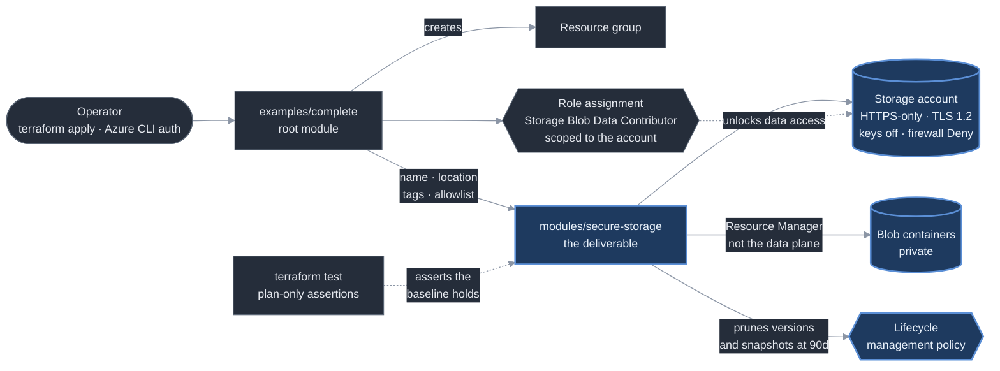

# Architecture

This project has no runtime. There is no trigger, no compute and no schedule —
the artifact is a Terraform module, and the diagram below is its call graph and
resource boundary rather than a request path.

**Services used:** Azure Storage (StorageV2) · Azure RBAC · Terraform
(`hashicorp/azurerm` 4.x).

## The module boundary

The module owns exactly three resources: the storage account, its containers,
and its lifecycle management policy. It deliberately does **not** create the
resource group, and it declares no `provider` block — both belong to the root
module, so the same module can be consumed by callers with different provider
configurations, subscriptions or resource group strategies.

The design argument is that not every setting should be an input. Two controls
are fixed with no variable at all (`https_traffic_only_enabled = true`,
`allow_nested_items_to_be_public = false`), several are variables whose
validation refuses an insecure value, and the rest are free. A module that
exposes everything is a thin wrapper around the provider and guarantees
nothing; a module that exposes nothing cannot be reused. The tiering is where
the opinion lives.

## Auth, and why the role assignment is in the diagram

The operator authenticates to Azure with the Azure CLI (`az login`). There is
no service principal, no client secret and no OIDC federation — consistent with
the portfolio's standing decision that `terraform apply` is a workstation
operation, not a pipeline one.

Because the module disables shared access keys by default, the account is
*unusable* on creation until a principal is granted a data-plane role. That is
the intended failure mode: access is granted deliberately rather than inherited
from whoever can manage the resource.

The distinction the dotted edge represents is the one Azure makes and most
people miss. A **control-plane** role (`Owner`, `Contributor`, `Storage Account
Contributor`) authorises management of the account *resource* through Azure
Resource Manager. A **data-plane** role (`Storage Blob Data Reader` /
`Contributor`) authorises operations on the *blobs inside it*. Holding one
grants nothing on the other, and the failure looks like a 403 against a token
that is entirely valid — the bug that cost `azure-drift-detector` a checkpoint
and was backported to `azure-cost-sentinel`.

The assignment is scoped to the storage account, not the resource group. The
resource group is a ceiling, not a default.

## Container creation without the data plane

`azurerm_storage_container` is given `storage_account_id` rather than
`storage_account_name`. The two arguments select different code paths in the
provider: the name form talks to the blob data plane and needs an account key
or a blob data role, while the ID form provisions through Azure Resource
Manager. With shared keys disabled by default, only the ID form works during
the same apply that creates the account.

## State

State is local, and `*.tfstate` is gitignored. This matters more than it does
in the portfolio's Bicep projects: Terraform state is plaintext JSON containing
the subscription ID, every resource ID, and — for a storage account — the
primary and secondary access keys. Bicep produces no comparable artifact.

A remote state backend is documented as out of scope rather than half-built. It
would need a storage account to hold the state, which is the thing this module
creates.
